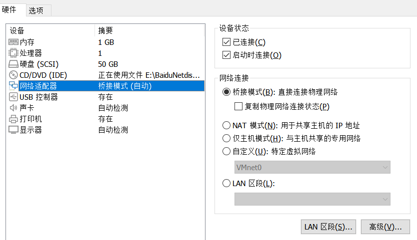
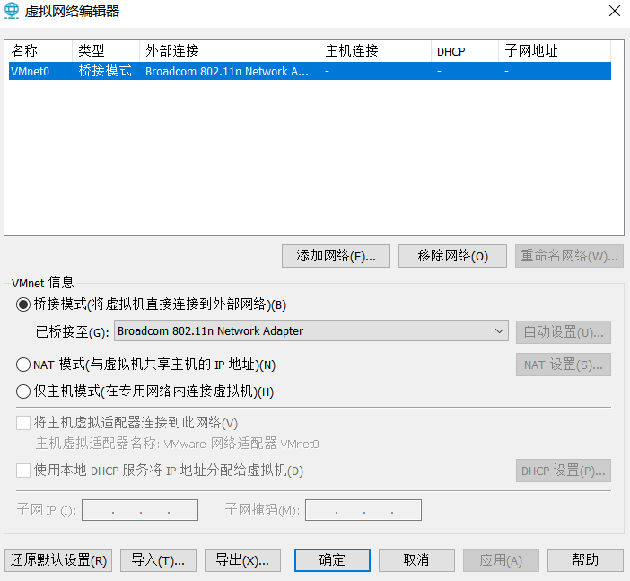
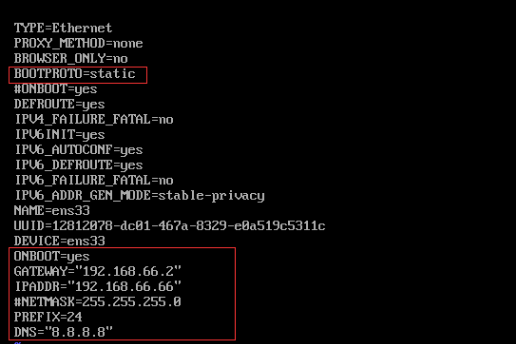
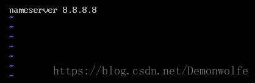
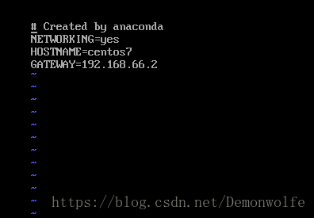
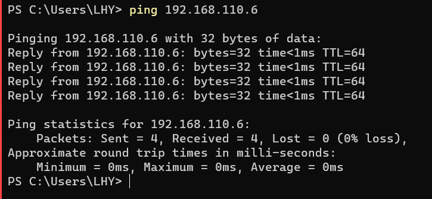
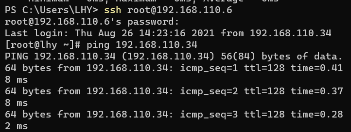

目的：为了是主机和虚拟机实现相互连通
虚拟机以CentOS为例：
步骤：
1、windows主机命令行输入ipconfig /all确定已连接网络的网段和网关。
2、Vmware虚拟机--设置--硬件--网络适配器设置成桥接模式，
3、Vmware编辑--虚拟网络编辑器--选择桥接模式桥接到你Windows主机已连接的网络
4、给Linux虚拟机设置一个静态IP
+ vi /etc/sysconfig/network-scripts/ifcfg-ens33
     
+ vi /etc/resolv.conf
     
+ vi /etc/sysconfig/network
     
+ service network restart
5、windows主机和Linux虚拟机，相互ping一下，测试一下连通性

